# Source-Code-Analyse-Tool

A modern web application designed to analyze and manage source code repositories. It provides insights into transition planning, technical debt, and AI-driven code reviews.

## ✨ Visual Showcase

### Project Management
<table>
  <tr>
    <td width="50%">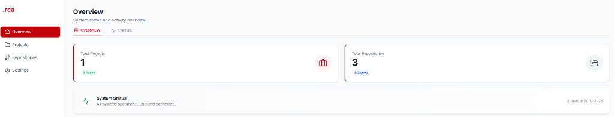<br/><sub><b>System Overview</b>: Real-time status and cross-project metrics at a glance.</sub></td>
    <td width="50%">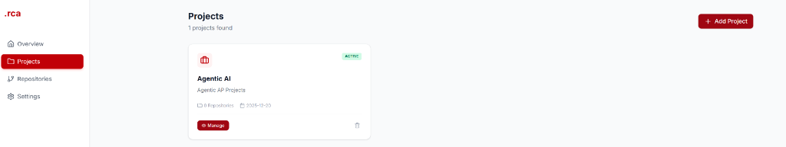<br/><sub><b>Project Hub</b>: Centralized management and access to all analysis projects.</sub></td>
  </tr>
  <tr>
    <td width="50%">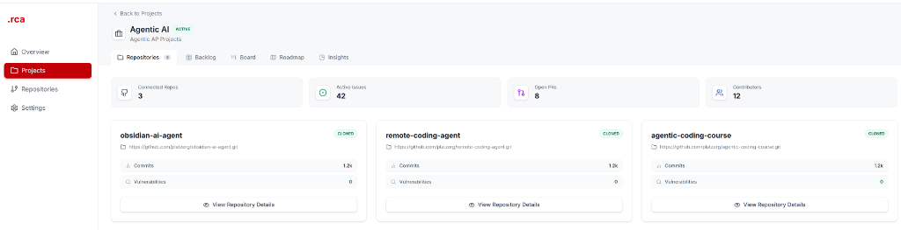<br/><sub><b>Project Deep-Dive</b>: Detailed view of repositories assigned to a specific project.</sub></td>
    <td width="50%">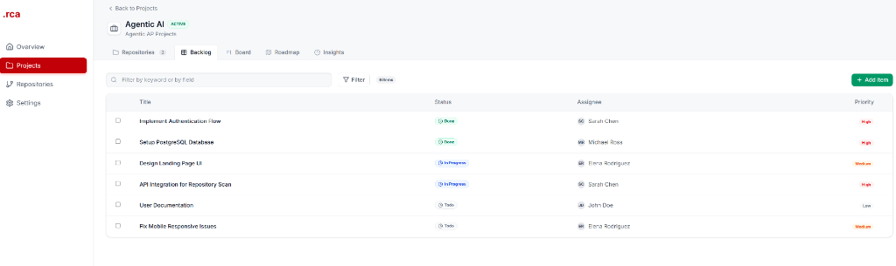<br/><sub><b>Backlog Management</b>: Prioritized list of tasks and feature requests.</sub></td>
  </tr>
  <tr>
    <td width="50%"><br/><sub><b>Agile Tracking</b>: Interactive board for managing development tasks.</sub></td>
    <td width="50%">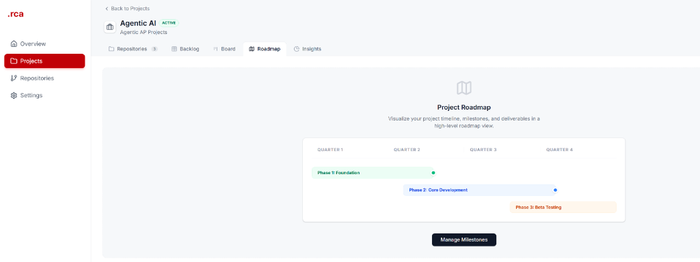<br/><sub><b>Strategic Planning</b>: Multi-quarter roadmap visualization.</sub></td>
  </tr>
</table>

### Repository Operations
<table>
  <tr>
    <td width="50%">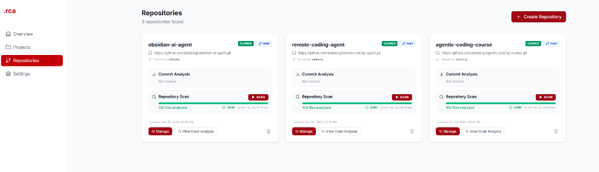<br/><sub><b>Repo Management</b>: Live progress tracking for clones and scans.</sub></td>
    <td width="50%">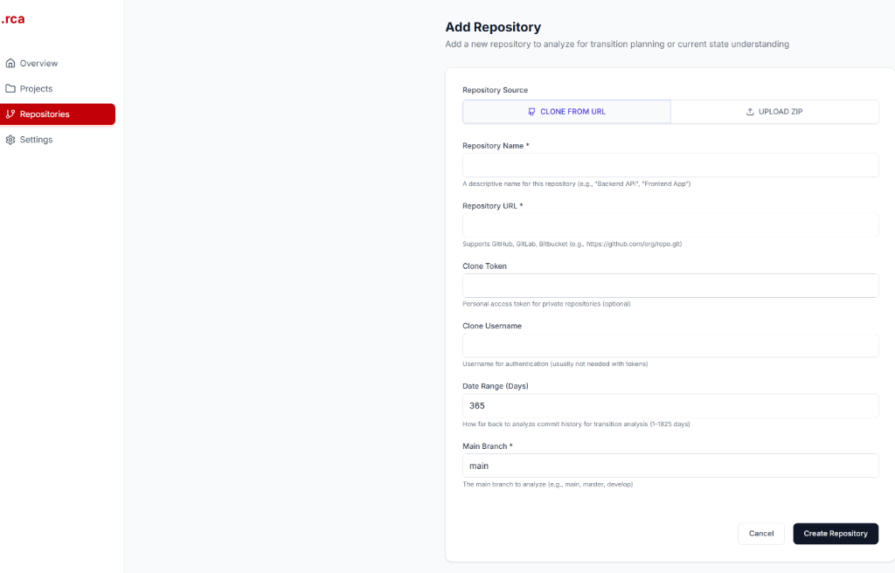<br/><sub><b>Smart Integration</b>: Streamlined onboarding for remote or local repos.</sub></td>
  </tr>
</table>

### AI-Driven Analysis & Development assistance
<table>
  <tr>
    <td width="50%">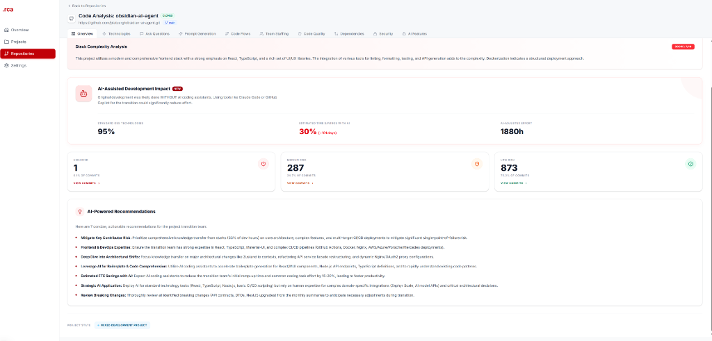<br/><sub><b>Impact Assessment</b>: AI recommendations and development effort estimation.</sub></td>
    <td width="50%">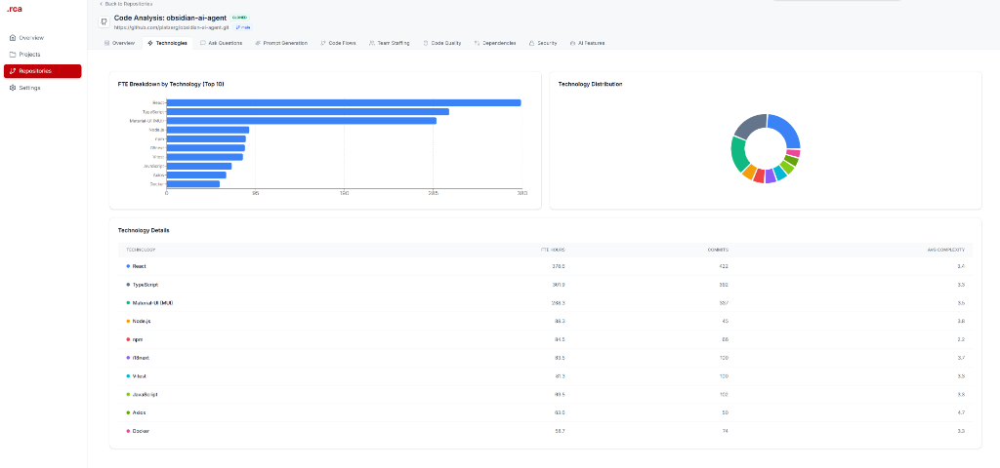<br/><sub><b>Architectural Audit</b>: Deep-dive into technical composition and complexity.</sub></td>
  </tr>
  <tr>
    <td width="50%">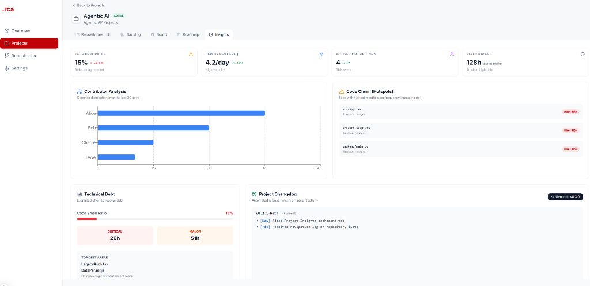<br/><sub><b>Health Analytics</b>: Contributor analysis, code churn, and debt hotspots.</sub></td>
    <td width="50%">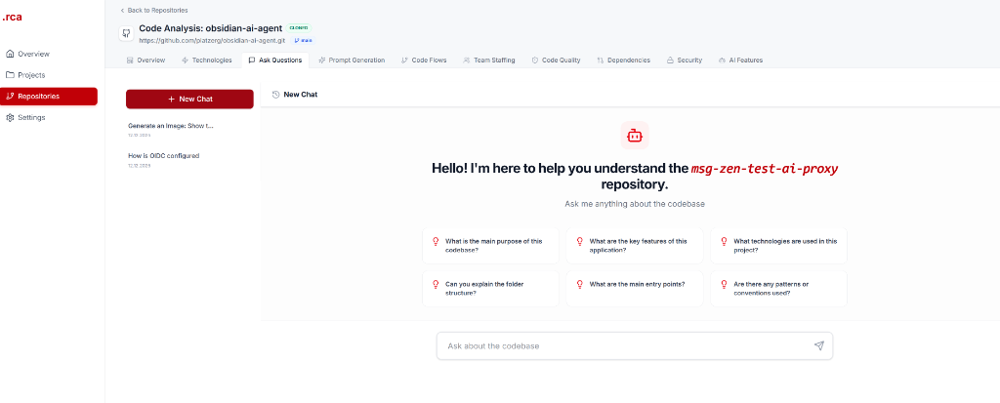<br/><sub><b>Contextual AI</b>: Interactive chat for deep codebase querying and understanding.</sub></td>
  </tr>
  <tr>
    <td width="50%">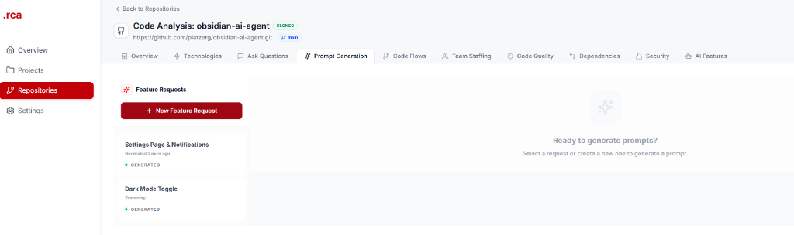<br/><sub><b>Feature Request Hub</b>: Track and manage AI-generated implementation prompts.</sub></td>
    <td width="50%">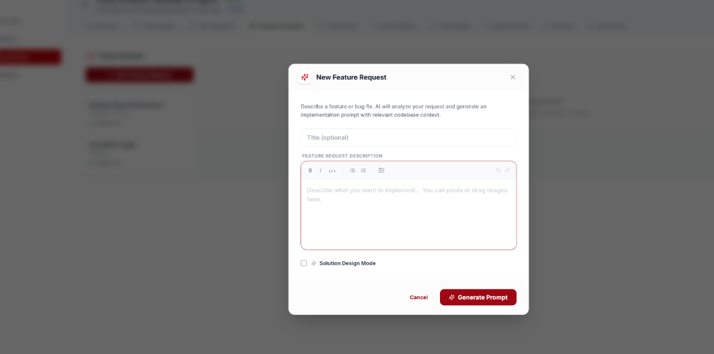<br/><sub><b>Guided Prompting</b>: Structured interface for defining new features for AI analysis.</sub></td>
  </tr>
  <tr>
    <td width="50%">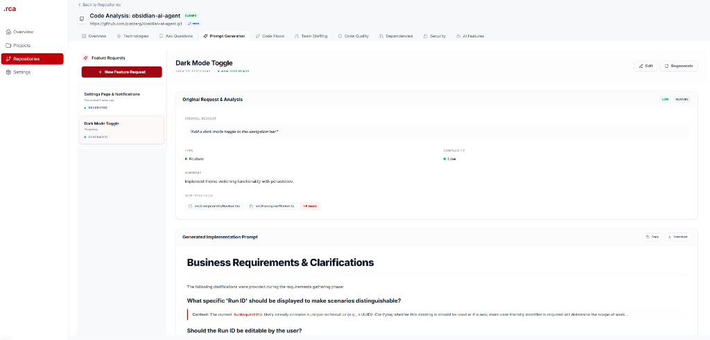<br/><sub><b>Implementation Blueprints</b>: AI-generated documentation for developers.</sub></td>
    <td width="50%">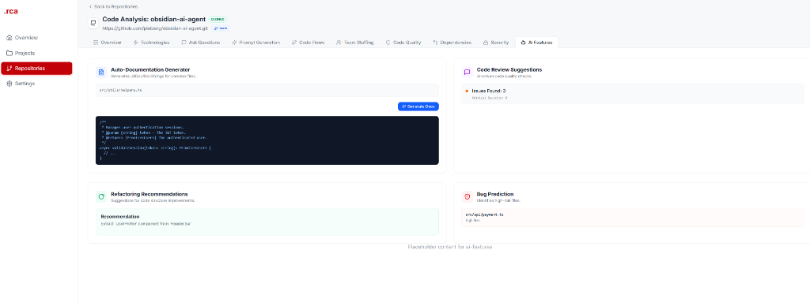<br/><sub><b>AI Automation</b>: Auto-documentation, code review suggestions, and bug prediction.</sub></td>
  </tr>
</table>

### Deep Technical Analysis
<table>
  <tr>
    <td width="50%">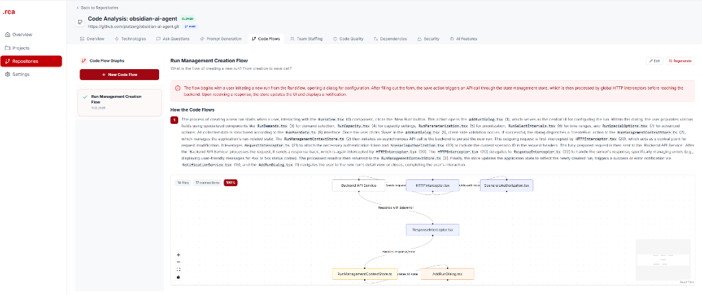<br/><sub><b>Logic Visualization</b>: Automated mapping of application flows and logic paths.</sub></td>
    <td width="50%">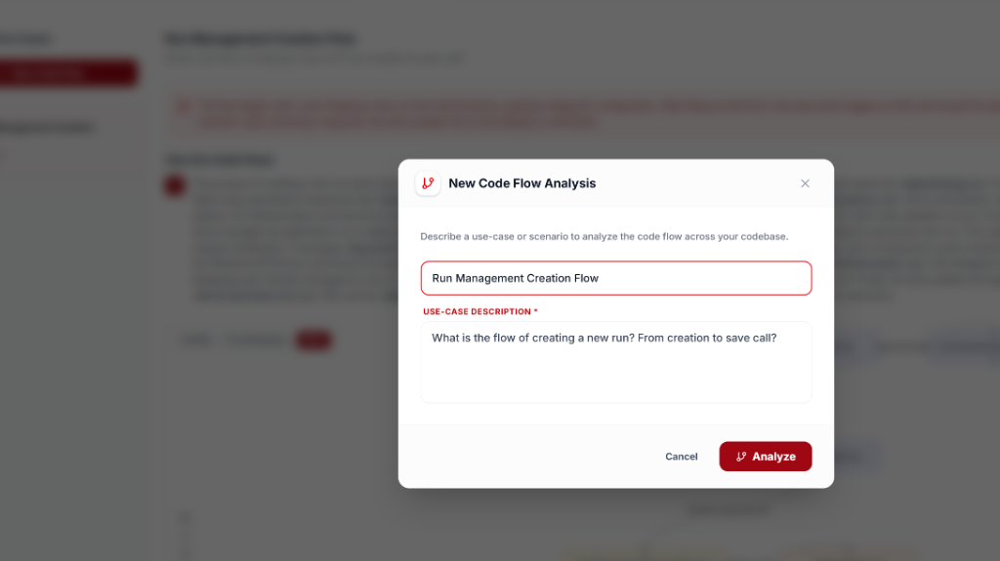<br/><sub><b>Scenario Analysis</b>: Define and analyze specific use-cases across the codebase.</sub></td>
  </tr>
  <tr>
    <td width="50%">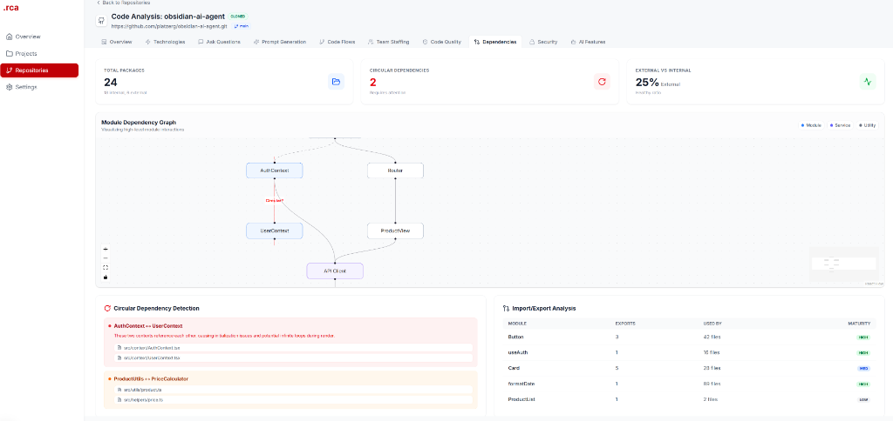<br/><sub><b>Structural Audit</b>: Visualizing module interactions and circular dependency detection.</sub></td>
    <td width="50%">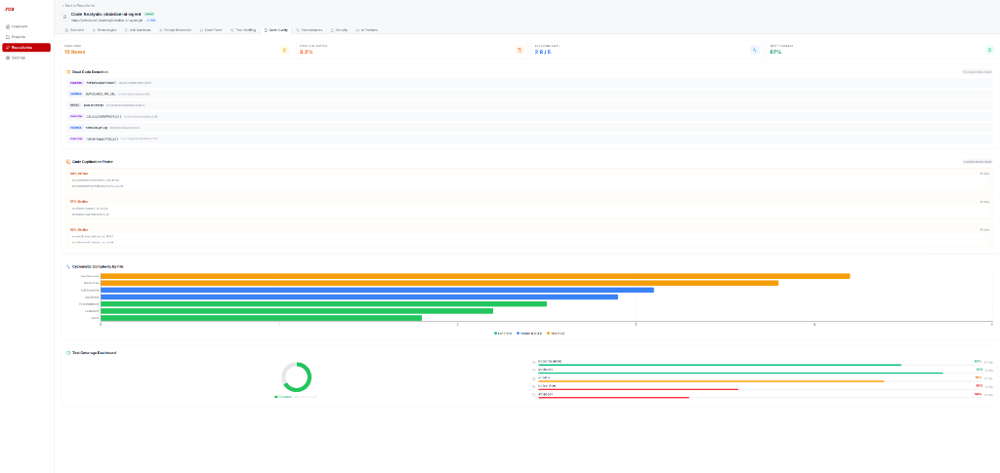<br/><sub><b>Quality Guardrails</b>: Dead code detection, complexity hotspots, and coverage trends.</sub></td>
  </tr>
  <tr>
    <td colspan="2">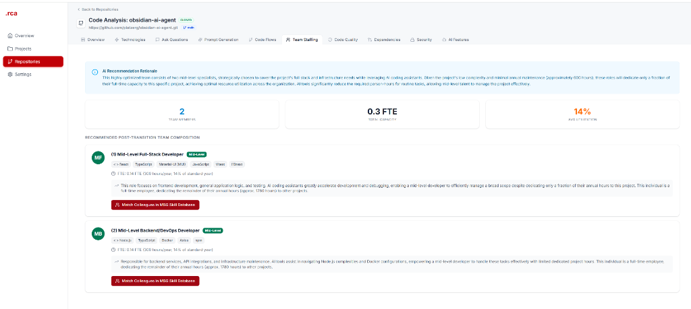<br/><sub><b>Resource Optimization</b>: AI-recommended team composition based on complexity.</sub></td>
  </tr>
</table>

### Security, Compliance & Customization
<table>
  <tr>
    <td width="50%">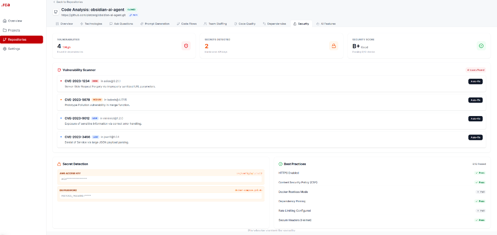<br/><sub><b>Security Shield</b>: Vulnerability scanning, secret detection, and best-practice checks.</sub></td>
    <td width="50%">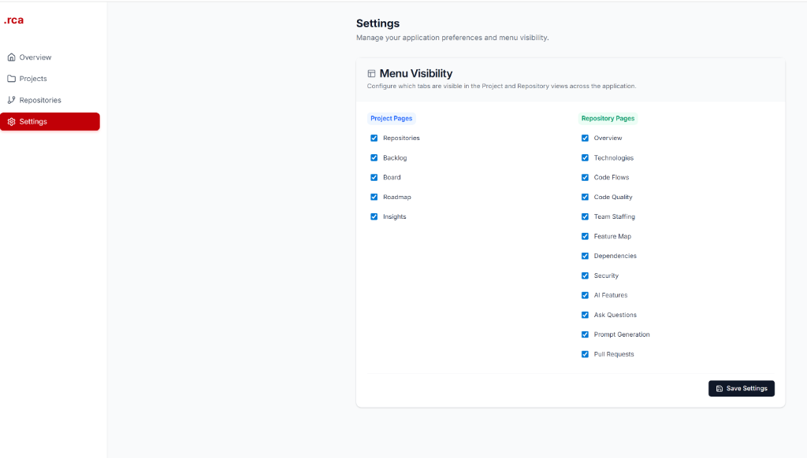<br/><sub><b>Configuration</b>: Global application preferences and menu visibility control.</sub></td>
  </tr>
</table>

## 🚀 Features

- **Project Management**: Organize and track multiple source code projects.
- **Repository Integration**: Clone or upload repositories for deep analysis.
- **GitHub Integration**: Automatic enrichment with repository metadata (stars, issues, contributors).
- **AI-Driven Insights**: Automated documentation, code reviews, and bug predictions using AI.
- **Dashboard Metrics**: Visualize total value, active categories, and project health.
- **Interactive Roadmap**: Timeline-based Gantt chart with drag-and-drop scheduling.
- **Real-time Status**: Live streaming of repository cloning and scanning progress.
- **AI-Driven Contextual Analysis (RAG)**: Automatically clones Git repositories, parses code, and enables semantic search/chat via vector embeddings in Supabase.
- **API Observability**: Optional Langfuse integration for performance monitoring and tracing.
- **Robust Architecture**: Layered backend with atomic writes, retry logic, and error handling.

## 🏗 Modular Architecture

The system is designed with a decoupled, service-oriented architecture for maximum flexibility:

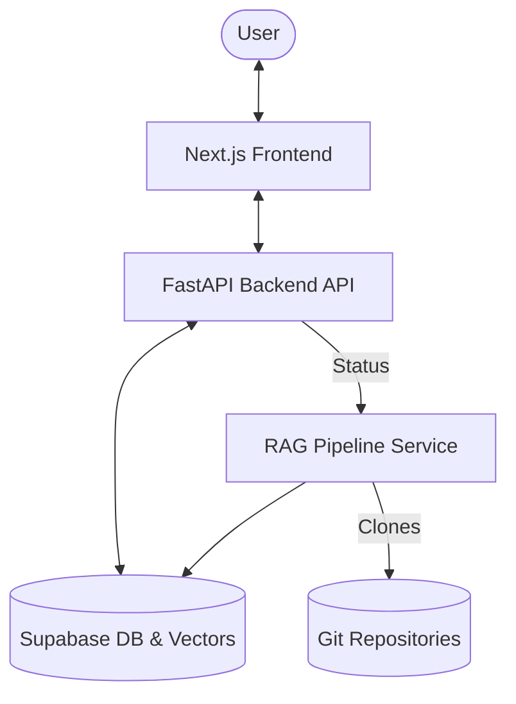

- **`backend/`**: Core API handling project management, user state, and orchestration.
- **`backend_rag_pipeline/`**: Specialized worker for repository analysis, cloning, and document vectorization.
- **`frontend/`**: Modern React/Next.js interface for data visualization and interaction.

## 🗺️ Application Navigation & Structure

The application is organized into four main sections. Below is a complete breakdown of every menu and tab available in the system.

### 1. 🏠 Dashboard (`/`)
Central hub for system-wide monitoring and status.
- **Tabs**:
  - **Overview**: High-level metrics including Total Projects, Active Projects, Total Repositories, and System Status.
  - **Status**: Real-time status list of all active projects and repositories with their current scan/analysis state.

### 2. 📁 Projects (`/projects`)
Manage your source code projects.
- **Main View**: List of all projects with "Add Project" functionality.
- **Project Detail View** (`/projects/[id]`):
  - **Repositories**: List of repositories linked to this project with key stats (contributors, issues, PRs).
  - **Backlog**: Task management table with filtering, priority sorting, and assignment.
  - **Board**: Kanban board with drag-and-drop tasks grouped by status (Todo, In Progress, Done).
  - **Roadmap**: Interactive Gantt chart for milestone planning and timeline visualization.
  - **Insights**: Deep analytics including Tech Debt Ratio, Contributor Analysis, Code Churn, and automated Changelog generation.

### 3. 📦 Repositories (`/repositories`)
Manage individual code repositories and view deep technical analysis.
- **Main View**: List of all repositories with status indicators (Cloned, Scanned, Error).
- **Repository Detail View** (`/repositories/[id]`):
  - **Overview**: Executive summary, "Stack Complexity Analysis", "AI-Assisted Development Impact", and high-level risk assessment.
  - **Technologies**: Breakdown of languages and frameworks used (FTE estimation, commit activity).
  - **Ask Questions**: AI Chat interface for querying the codebase context.
  - **Prompt Generation**: Feature to generate implementation prompts for new requirements.
  - **Code Flows**: Visual flowcharts of code logic and application scenarios.
  - **Team Staffing**: AI-driven team composition recommendations based on required skills.
  - **Code Quality**: Analysis of dead code, duplication blocks, and cyclomatic complexity.
  - **Dependencies**: Visualization of internal/external dependencies and circular dependency detection.
  - **Security**: Vulnerability reporting, secret detection, and compliance checks.
  - **Pull Requests**: List of recent pull requests and their status.
  - **Feature Map**: Node-based visualization of feature relationships within the codebase.
  - **AI Features**: Hub for advanced AI tools (Auto-Documentation, Bug Prediction, Reviewer).

### 4. ⚙️ Settings (`/settings`)
Global configuration for the application.
- **Menu Visibility**:
  - **Project Pages**: Toggle visibility for Repositories, Backlog, Board, Roadmap, and Insights tabs.
  - **Repository Pages**: Toggle visibility for all 12 repository analysis tabs (Overview, Technologies, Security, etc.).

## 🛠 Tech Stack

### Backend
- **Framework**: FastAPI (Python 3.12+)
- **Architecture**: Layered architecture with separation of concerns
  - **Routes Layer**: API endpoints with request/response handling
  - **Service Layer**: Business logic and orchestration
  - **Storage Layer**: Robust JSON file handling with atomic writes and backups
  - **Models Layer**: Pydantic schemas for data validation
- **External Integrations**: 
  - GitHub API for repository metadata (stars, issues, contributors)
  - Robust HTTP client with retry logic and timeout handling
- **Observability**: Langfuse integration for API tracing and performance monitoring
- **Server**: Uvicorn with auto-reload
- **Data Persistence**: Local JSON-based storage with thread-safe operations
- **RAG Pipeline**: 
  - **Modular Service**: Independent Python service for repository analysis.
  - **Git Integration**: Fast shallow cloning and delta-updates.
  - **Vector Storage**: Supabase PGVector with semantic search capabilities.

### Frontend
- **Framework**: Next.js 15 (React)
- **Styling**: Tailwind CSS
- **Components**: Lucide Icons, Custom UI components
- **State Management**: React Hooks & Fetch API
- **Internationalization**: react-i18next for multi-language support

## 📋 Getting Started

You can run the application either with **Docker** (recommended for production) or **locally** (for development).

### Option 1: Docker Deployment (Recommended)

The easiest way to get started. Requires only Docker installed.

#### Prerequisites
- Docker Desktop (Windows/Mac) or Docker Engine (Linux)
- Docker Compose (included with Docker Desktop)

#### Quick Start
```powershell
# Clone the repository
git clone https://github.com/platzerg/Source-Code-Analyse-Tool.git
cd Source-Code-Analyse-Tool

# (Optional) Configure Langfuse for observability
# Create a .env file in the project root:
# LANGFUSE_PUBLIC_KEY=pk-lf-...
# LANGFUSE_SECRET_KEY=sk-lf-...
# LANGFUSE_HOST=https://cloud.langfuse.com

# Core AI & Database (Required for RAG)
# SUPABASE_URL=https://xxxx.supabase.co
# SUPABASE_SERVICE_KEY=xxx
# EMBEDDING_API_KEY=sk-xxx

# Build and start all services
docker compose up -d

# View logs
docker compose logs -f

# Stop all services
docker compose down
```

**Access the application:**
- Frontend: `http://localhost:3509`
- Backend API: `http://localhost:8359`
- API Documentation: `http://localhost:8359/docs`

- ✅ Production-ready configuration

### Option 2: Deployment Strategies (Cloud)

For production-grade deployments, we recommend the following strategies:

| Platform | Best For | Scaling | Setup |
|----------|----------|---------|-------|
| **DigitalOcean** | Prototypes / Small Teams | Manual | Easy (Docker Compose) |
| **Render** | Moderate Traffic | Automatic | Managed Infrastructure |
| **Google Cloud** | Enterprise / High Scale | Serverless | Cloud Run / Cloud Run jobs |

### Option 3: Local Development Setup

For development with hot-reload and debugging.

#### Prerequisites
- Python 3.12 or higher
- Node.js 18 or higher
- npm or yarn

### Installation & Setup

#### 1. Backend Setup
```powershell
cd backend
python -m venv .venv
.\.venv\Scripts\Activate.ps1
pip install -r requirements.txt
```

#### 2. Configure Langfuse (Optional)
For API observability and performance monitoring, create a `.env` file in the `backend` directory:

```env
# Optional - Langfuse Observability
LANGFUSE_PUBLIC_KEY=pk-lf-...
LANGFUSE_SECRET_KEY=sk-lf-...
LANGFUSE_HOST=https://cloud.langfuse.com
```

Get your free Langfuse account at [https://cloud.langfuse.com](https://cloud.langfuse.com)

**Note**: The application works perfectly without Langfuse credentials. Tracing will be automatically disabled if credentials are not provided.

#### 3. Frontend Setup
```powershell
cd frontend
npm install
```

### Running the Application

#### Start Backend
```powershell
cd backend
.\.venv\Scripts\python.exe -m uvicorn app.main:app --reload --host 127.0.0.1 --port 8000
```

#### Start Frontend
```powershell
cd frontend
npm run dev
```
The application will be available at `http://localhost:3000`.

## ⚙️ Configuration (Environment Variables)

### Core Backend & RAG Pipeline
```env
# LLM & Embeddings
LLM_PROVIDER=openai
LLM_API_KEY=sk-...
EMBEDDING_API_KEY=sk-...
EMBEDDING_MODEL_CHOICE=text-embedding-3-small

# Database (Supabase)
SUPABASE_URL=https://your-project.supabase.co
SUPABASE_SERVICE_KEY=your-service-key

# RAG Configuration
RAG_PIPELINE_TYPE=git  # local or git
RUN_MODE=continuous    # continuous or single
```

### Observability (Optional)
```env
LANGFUSE_PUBLIC_KEY=pk-...
LANGFUSE_SECRET_KEY=sk-...
LANGFUSE_HOST=https://cloud.langfuse.com
```

## 🔍 Verification & Health Checks

Monitor the system health using these endpoints:

- **Backend Health**: `GET http://localhost:8359/api/v1/health`
- **Frontend Health**: `GET http://localhost:3509/health`
- **RAG Logs**: `docker compose logs -f rag-pipeline`

## 🧪 Testing

The project includes a comprehensive test suite covering the database layer, API endpoints, and critical integration use cases.

### Running Backend Tests
```powershell
# Navigate to backend directory
cd backend

# Execute pytest with verbose output
.\.venv\Scripts\python.exe -m pytest tests -v
```

### Test Coverage
- **Repository Layer**: Unit tests for `ProjectRepository` and `RepositoryRepository` (CRUD & Relationships).
- **API Endpoints**: E2E tests for Projects and Repositories (fastapi.testclient).
- **Integration**: Full project lifecycle testing (Create -> Link -> Verify aggregation).
- **Cleanup**: All tests use automatic database cleanup via pytest fixtures.

Current Status: ✅ **12 Tests Passed**

## 📂 Project Structure

- `backend/`: FastAPI application, API endpoints, and local data storage.
- `backend_rag_pipeline/`: Specialized service for repository analysis, cloning, and RAG.
- `frontend/`: Next.js application with a modern, responsive UI.
- `9_Agent_SaaS/`: Reference integration modules for Agent-based SaaS features.

## 🛡 License
Distributed under the MIT License. See `LICENSE` for more information.

---
Built with ❤️ by Platzer Günter
