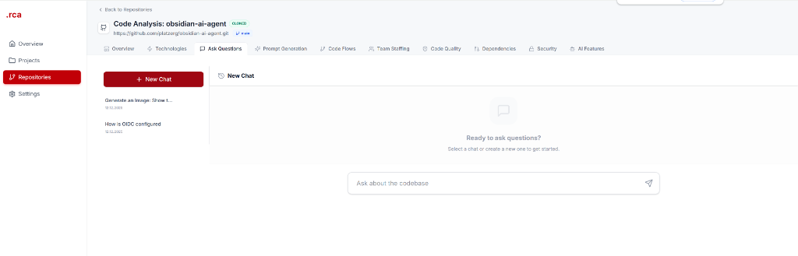

# Source-Code-Analyse-Tool

A modern web application designed to analyze and manage source code repositories. It provides insights into transition planning, technical debt, and AI-driven code reviews.

## ✨ Visual Showcase

### Project Management
<table>
  <tr>
    <td width="50%"><br/><sub><b>System Overview</b>: Real-time status and cross-project metrics at a glance.</sub></td>
    <td width="50%"><br/><sub><b>Project Hub</b>: Centralized management and access to all analysis projects.</sub></td>
  </tr>
  <tr>
    <td width="50%"><br/><sub><b>Agile Tracking</b>: Interactive board for managing development tasks.</sub></td>
    <td width="50%"><br/><sub><b>Strategic Planning</b>: Multi-quarter roadmap visualization.</sub></td>
  </tr>
</table>

### Repository Operations
<table>
  <tr>
    <td width="50%"><br/><sub><b>Repo Management</b>: Live progress tracking for clones and scans.</sub></td>
    <td width="50%"><br/><sub><b>Smart Integration</b>: Streamlined onboarding for remote or local repos.</sub></td>
  </tr>
</table>

### AI-Driven Analysis
<table>
  <tr>
    <td width="50%"><br/><sub><b>Impact Assessment</b>: AI recommendations and development effort estimation.</sub></td>
    <td width="50%"><br/><sub><b>Architectural Audit</b>: Deep-dive into technical composition and complexity.</sub></td>
  </tr>
  <tr>
    <td width="50%"><br/><sub><b>Health Analytics</b>: Contributor analysis, code churn, and debt hotspots.</sub></td>
    <td width="50%"><br/><sub><b>Contextual AI</b>: Interactive chat for deep codebase querying.</sub></td>
  </tr>
</table>

## 🚀 Features

- **Project Management**: Organize and track multiple source code projects.
- **Repository Integration**: Clone or upload repositories for deep analysis.
- **AI-Driven Insights**: Automated documentation, code reviews, and bug predictions using AI.
- **Dashboard Metrics**: Visualize total value, active categories, and project health.
- **Real-time Status**: Live streaming of repository cloning and scanning progress.

## 🛠 Tech Stack

### Backend
- **Framework**: FastAPI (Python 3.12+)
- **Analysis**: Custom AI simulation and static analysis logic
- **Server**: Uvicorn with Auto-reload
- **Data Persistence**: Local JSON-based storage (managed via `projects.json` and `repositories.json`)

### Frontend
- **Framework**: Next.js 15 (React)
- **Styling**: Tailwind CSS
- **Components**: Lucide Icons, Custom UI components
- **State Management**: React Hooks & Fetch API

## 📋 Getting Started

### Prerequisites
- Python 3.12 or higher
- Node.js 18 or higher
- npm or yarn

### Installation & Setup

#### 1. Backend Setup
```powershell
cd backend
python -m venv .venv
.\.venv\Scripts\Activate.ps1
pip install -r requirements.txt  # Or use the pyproject.toml dependencies
```

#### 2. Frontend Setup
```powershell
cd frontend
npm install
```

### Running the Application

#### Start Backend
```powershell
cd backend
.\.venv\Scripts\python.exe -m uvicorn app.main:app --reload --host 127.0.0.1 --port 8000
```

#### Start Frontend
```powershell
cd frontend
npm run dev
```
The application will be available at `http://localhost:3000`.

## 📂 Project Structure

- `backend/`: FastAPI application, API endpoints, and local data storage.
- `frontend/`: Next.js application with a modern, responsive UI.
- `9_Agent_SaaS/`: Integration modules for Agent-based SaaS features.

## 🛡 License
Distributed under the MIT License. See `LICENSE` for more information.

---
Built with ❤️ by Platzer Günter
